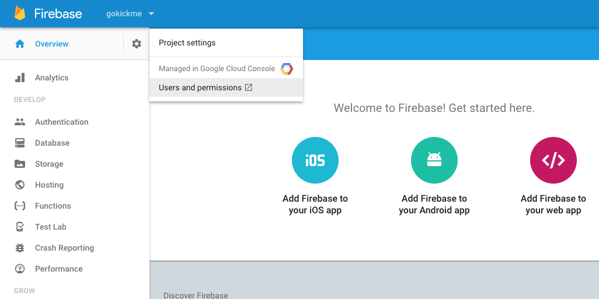
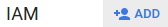
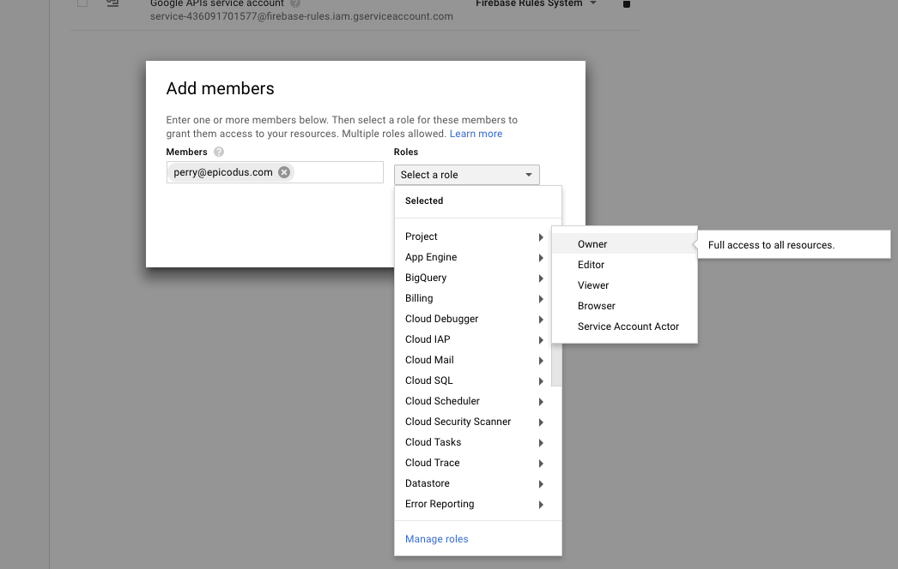

# Firebase Info

Repository for Information about Firebase

  1.  Select your project in the [Firebase Console](https://firebase.google.com/)
  2.  In the top left, next to the project name, click the settings/gear wheel icon
  3.  Click "Users and permissions" 
  4.  In the Google Developer Console click 
  5.  Enter the name/email of the user to add and select the role 
  6.  Click "Add"
  7.  User likely will not get an email, but they just need to log in to their Firebase and project will populate.  API keys will be set per project and all collaborators share the same API for that project.
  8.  Now go save the World.

Table of contents
=================

  * [Firebase Info](#firebase-info)
    * [Firebase Documentation](https://firebase.google.com/docs/)
  * [Table of contents](#table-of-contents)
  * [Installation](#installation)
  * [Specifications](#specifications)
  * [Known Bugs](#known-bugs)
  * [Contributing](#contributing)
  * [License](#license)

## Installation

No installation process is required for this.  It is only informational.

## Specifications

This is just a simple README for some basic Firebase information

## Known Bugs
* "Rich Garrick" <richg341@gmail.com>

## Contributing

1. Fork it!
2. Create your feature branch: `git checkout -b my-new-feature`
3. Commit your changes: `git commit -am 'Add some feature'`
4. Push to the branch: `git push origin my-new-feature`
5. Submit a pull request :D

## License
The MIT License (MIT)
Copyright 2017 Rich Garrick

Permission is hereby granted, free of charge, to any person obtaining a copy of this software and associated documentation files (the "Software"), to deal in the Software without restriction, including without limitation the rights to use, copy, modify, merge, publish, distribute, sublicense, and/or sell copies of the Software, and to permit persons to whom the Software is furnished to do so, subject to the following conditions:

The above copyright notice and this permission notice shall be included in all copies or substantial portions of the Software.

THE SOFTWARE IS PROVIDED "AS IS", WITHOUT WARRANTY OF ANY KIND, EXPRESS OR IMPLIED, INCLUDING BUT NOT LIMITED TO THE WARRANTIES OF MERCHANTABILITY, FITNESS FOR A PARTICULAR PURPOSE AND NONINFRINGEMENT. IN NO EVENT SHALL THE AUTHORS OR COPYRIGHT HOLDERS BE LIABLE FOR ANY CLAIM, DAMAGES OR OTHER LIABILITY, WHETHER IN AN ACTION OF CONTRACT, TORT OR OTHERWISE, ARISING FROM, OUT OF OR IN CONNECTION WITH THE SOFTWARE OR THE USE OR OTHER DEALINGS IN THE SOFTWARE.
